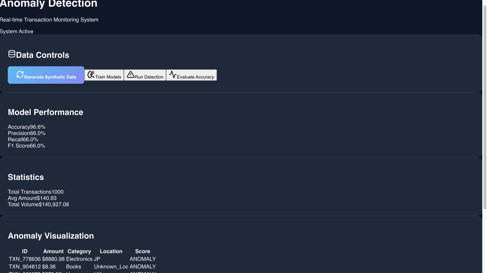

# Anomaly Detection in Transaction Data

1. **Project Overview**
   This project demonstrates a real-time anomaly detection system for e-commerce transactions. It uses a FastAPI backend with Machine Learning models (Isolation Forest and Autoencoder) and a React frontend for visualization.

    

2. **Prerequisites**
   - Python 3.8+
   - Node.js 16+
   - npm

3. **Installation**
   1. **Clone the repository**
   2. **Backend Setup**
      ```bash
      python3 -m venv venv
      source venv/bin/activate
      pip install -r backend/requirements.txt
      ```
   3. **Frontend Setup**
      ```bash
      cd frontend
      npm install
      ```

4. **Running the Application**
   1. **Start the Backend**
      ```bash
      # From the root directory
      source venv/bin/activate
      uvicorn backend.main:app --reload
      ```
   2. **Start the Frontend**
      ```bash
      # From the frontend directory
      npm run dev
      ```
   3. **Access the Dashboard**
      Open your browser and navigate to `http://localhost:5173`

5. **Features**
   1. **Synthetic Data Generation**: Create realistic transaction data with anomalies.
   2. **Model Training**: Train Isolation Forest and Autoencoder models.
   3. **Anomaly Detection**: Detect and visualize suspicious patterns.
   4. **Interactive Dashboard**: View statistics and anomaly details in real-time.
